<div align="center">

# MedFlow v4.0

### National Clinical Governance Engine

<br>

[](iso42001-artifacts/)
[](#intellectual-property)
[](#data-integrity-statement)
[](#-strategic-framework)
[](#)

<br>

**Lead Architect:** Dr. Islam Mekawy, MD, MSc, CPHIMS, CCDS, FLMI, Stanford AI, PECB ISO 42001 Lead Implementer (AIMS)
**Patent Status:** SAIP Application Pending — 15 Filed Claims &nbsp;·&nbsp; **Jurisdiction:** Kingdom of Saudi Arabia

</div>

---

## 📋 Executive Summary

MedFlow v4.0 is a sovereign clinical decision support system engineered for healthcare insurance prior-authorization in Saudi Arabia. It processes inpatient medical records, enforces Saudi Ministry of Health (MOH) clinical protocols, and delivers audit-ready coverage decisions with complete regulatory traceability across PDPL, NPHIES, and ISO 42001 frameworks.

The system addresses the central governance challenge in AI-assisted healthcare decisions: producing recommendations that are clinically sound, legally defensible, and free of algorithmic bias — in a jurisdiction with specific data sovereignty requirements. ISO 42001 controls, real-time risk monitoring, and traceability were architected into the core codebase from Day 1.

---

## 🏛️ Strategic Framework

<table>
<tr>
<td width="33%" valign="top">

### 🌐 &nbsp;Knowledge Sovereignty

Saudi MOH protocols are prioritized at **three times** the retrieval weight of international guidelines. Clinical evidence hierarchy is enforced at the algorithm level, not merely at the policy level. International guidelines must earn their place through rigorous NCEBM evidence scoring — a score below 60/100 triggers automatic exclusion with no override mechanism.

</td>
<td width="33%" valign="top">

### 🔐 &nbsp;Privacy by Architecture

Protected Health Information is eliminated locally before any data leaves the network. Triple-layer defense: Regex (L1) + locally-hosted Llama 3.2 (L2) + Leakage Validation and PII Manifest (L3). All processing occurs on-device. Zero patient data reaches cloud infrastructure at any stage. Saudi PDPL Article 5 compliant.

</td>
<td width="33%" valign="top">

### 🛡️ &nbsp;Preemptive NPHIES Compliance

Before any coverage decision is issued, a six-element documentation quality gate screens against NPHIES 960Z rejection criteria. Cases missing primary diagnosis codes, medication dosages, laboratory results, or radiology interpretations are flagged before submission — shifting quality control from reactive denial management to proactive documentation assurance.

</td>
</tr>
</table>

---

## ⚙️ Architecture: Six-Layer Sovereign Governance Defense

```mermaid
flowchart TD
    INPUT(["📄  INPUT — Inpatient Medical Records<br/>PDF · DOCX · JSON · Multi-day Clinical Episodes"])

    L1["🔐  LAYER 1 — PRIVACY SHIELD<br/>Triple-layer PHI defense · Regex + Llama 3.2 + Leakage Validation<br/>PII Manifest · Zero patient data reaches cloud infrastructure"]

    L2["📚  LAYER 2 — SOVEREIGN RAG ENGINE<br/>Protocol Hierarchy in Silicon · 3:1 MOH weighting<br/>0.65 Similarity Threshold · DRG-aware filtering"]

    L3["⚖️  LAYER 3 — NCEBM JUDGE<br/>6-Dimension evidence validation · Score <60/100 = automatic exclusion<br/>No override mechanism · SAIP patent claims 3–5"]

    L4["🧠  LAYER 4 — DECISION GATE<br/>Enterprise Multi-Model LLM Orchestration<br/>30+ day complex ICU episodes · Full clinical context · No truncation"]

    L5["🏥  LAYER 5 — CLINICAL INTEGRITY<br/>Saudi AR-DRG v9.0 · All 25 Major Diagnostic Categories<br/>Bidirectional upcoding detection · Pre-emptive 960Z gate"]

    L6["📋  LAYER 6 — AUDIT TRAIL<br/>Full decision provenance · Patent formula: (Evidence × Documentation × Alignment) / 3<br/>Timestamped JSONL event log · Every decision replay-able by any auditor"]

    OUTPUT(["✅  OUTPUT — Structured Decision Record<br/>Recommendation · Confidence Score · DRG Classification<br/>Full Audit Trail · PDPL · NPHIES · ISO 42001 Compliance Status"])

    INPUT --> L1 --> L2 --> L3 --> L4 --> L5 --> L6 --> OUTPUT

    style INPUT  fill:#1c2833,stroke:#3498db,color:#d6eaf8
    style L1     fill:#7b241c,stroke:#e74c3c,color:#fdfefe
    style L2     fill:#1a5276,stroke:#5dade2,color:#fdfefe
    style L3     fill:#4a235a,stroke:#a569bd,color:#fdfefe
    style L4     fill:#145a32,stroke:#2ecc71,color:#fdfefe
    style L5     fill:#7e5109,stroke:#f0b27a,color:#fdfefe
    style L6     fill:#1f4e79,stroke:#7fb3d3,color:#fdfefe
    style OUTPUT fill:#0b3d0b,stroke:#27ae60,color:#d5f5e3
```



---

## 🖥️ Governance Command Center

A live, demonstrable AI governance command center that runs synthetic NPHIES claims through MedFlow's 6-layer pipeline, calculates 21 governance metrics, persists everything to SQLite, and generates on-demand PDF audit reports.

| Capability | Detail |
|---|---|
| **Streamlit Dashboard** | Port 8502 — 21 monitor tiles, 7 metric groups, live simulation controls |
| **Simulation Modes** | BENCHMARK (~50ms/claim, no APIs), FAST (Gemini + RAG, no Llama), FULL (all layers) |
| **21 Governance Monitors** | Clinical Quality · Anti-Gaming · Distribution Drift · Saudi Sovereignty · RAG/Evidence · Pipeline Health · Output Quality |
| **SQLite Audit Trail** | 4 tables: sessions, metrics, layer telemetry, alert log — auto-created, persists across runs |
| **PDF Audit Reports** | reportlab A4 — 7 sections, ISO 42001 clause evidence, on-demand generation |
| **IBM watsonx.governance** | All 21 monitors mapped to watsonx commission_log.json MON IDs |

```bash
# Run BENCHMARK batch (no API keys required, ~50ms/claim)
python governance/pipeline_simulator.py --mode benchmark --batch

# Launch Governance Dashboard
streamlit run governance/governance_dashboard.py --server.port 8502

# Generate PDF Audit Report
python governance/audit_export.py --days 7
```

---

## 📡 Real-Time Governance Monitoring

The system maintains a continuous Real-Time Risk Monitor (RTRM v1.0.0) that subscribes to every decision event. Two independent drift signals are tracked simultaneously across a 100-event rolling window:

- **Signal 1 — Confidence Distribution:** Rolling window vs. baseline confidence score spread
- **Signal 2 — Recommendation Distribution:** Shift in approval / extension / discharge ratios

Any statistical deviation from the established baseline triggers an immediate pub/sub governance event — without human intervention. RISK-010 (model drift) has been upgraded to **MITIGATED** status via RTRM deployment.

---

## 🏆 ISO 42001 Compliance

Developed as a primary ISO 42001 Lead Implementer demonstration project. All development activity is documented to ISO 42001 evidence standards. Governance by Design — compliance was not an afterthought.

<br>

<div align="center">

| Compliance Metric | Status |
|:-----------------:|:------:|
| Controls Implemented |  |
| Internal Audit Result |  |
| Non-Conformances |  |
| Risk Controls |  |
| Governance Artifacts |  |
| Algorithmic Fairness |  |
| Regulatory Alignment |    |

</div>

---

## 📁 Governance Documentation

| Document | Version | Status |
|----------|:-------:|--------|
| [Statement of Applicability](iso42001-artifacts/Statement_of_Applicability.md) | v1.0 | Current |
| [AI Risk Register](iso42001-artifacts/AI_Risk_Register.md) | v5.1 | 16 risks documented |
| [Internal Audit Report](iso42001-artifacts/Internal_Audit_Report.md) | v1.5 | 97% conformance · 5/5 NCs closed |
| [ISO Compliance Matrix](iso42001-artifacts/ISO_COMPLIANCE_MATRIX.md) | v1.5 | 39/39 controls implemented |
| [Algorithmic Fairness Report](iso42001-artifacts/Algorithmic_Fairness_Report.md) | v1.1 | Zero-variance · NC-002 closure evidence |
| [Implementation Experience Log](iso42001-artifacts/Implementation_Experience_Log.md) | v2.3 | 329 hours documented · 25 sessions |
| [Management Review Minutes](iso42001-artifacts/Management_Review_Minutes.md) | v1.4 | Q1 2026 |
| [Continual Improvement Log](iso42001-artifacts/Continual_Improvement_Log.md) | v1.6 | 16 improvements documented |
| [Competence Assessment Matrix](iso42001-artifacts/Competence_Assessment_Matrix.md) | v1.3 | Current |
| [Algorithmic Impact Assessment](iso42001-artifacts/Algorithmic_Impact_Assessment.md) | v1.0 | Patient Safety |
| [Verification & Validation Plan](iso42001-artifacts/Verification_Validation_Plan.md) | v1.0 | Current |
| [AI Data Policy](iso42001-artifacts/AI_Data_Policy.md) | v1.0 | PDPL Aligned |

---

## ⚖️ Algorithmic Fairness

Independent counterfactual fairness validation per ISO 42001 Clause 8.2. Clinical inputs held constant while demographic variables — gender, age cohort (18–80+), nationality, and 6 distinct clinical presentations — were independently varied to isolate any differential treatment effect. Methodology is seed-reproducible: any auditor can re-run the exact test suite without access to the original environment.

<br>

<div align="center">

| Fairness Metric | Acceptable Threshold | Observed Variance | Result |
|:--------------:|:--------------------:|:-----------------:|:------:|
| Demographic Parity | < 10% | 0.00% |  |
| Calibration Parity | < 5% | 0.00% |  |
| Review Level Parity | < 10% | 0.00% |  |
| Equal Opportunity | < 15% | 0.00% |  |

</div>

<br>

Full methodology and evidence: [Algorithmic Fairness Report](iso42001-artifacts/Algorithmic_Fairness_Report.md)

---

## 🔬 Data Integrity Statement

All patient data used in development, testing, and validation is synthetically generated. The gold standard validation matrix spans all clinical severity trajectories — improving, stable, deteriorating, and atypical presentation arcs — produced by a proprietary Synthetic Clinical Episode Generator. Zero real PHI (Protected Health Information) was exposed at any stage of development or validation.

This design ensures full compliance with the Saudi Personal Data Protection Law (PDPL) and eliminates all identifiable health information from the research and validation pipeline from Day 1.

---

## 🔒 Intellectual Property

The 6-layer governance architecture, NCEBM 6-dimension evidence scoring (patent claims 3–5), 960Z pre-emptive extraction rules, and the patent confidence formula `(Evidence × Documentation × Alignment) / 3` are subject to an active **SAIP patent application — 15 filed claims** — and are not included in this public repository.

---

## 📬 Contact

<div align="center">

**Dr. Islam Mekawy**
MD · MSc · CPHIMS · CCDS · FLMI · Stanford AI · PECB ISO 42001 Lead Implementer (AIMS)

*Lead Architect & Principal Researcher · Kingdom of Saudi Arabia*

<br>

[](mailto:eslammekkawy3@gmail.com)
[](https://www.linkedin.com/in/islam-mekawy-624b5b194/)
[](https://wa.me/966567054862)

<br>

*Personal Research Initiative — Kingdom of Saudi Arabia, 2026*

</div>
